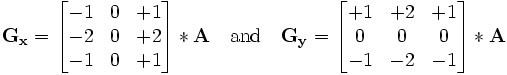

# 二 边缘检测
## 1.索贝尔算子（Sobel operator）
    主要用作边缘检测，在技术上，它是一离散性差分算子，用来运算图像亮度函数的灰度之近似值。在图像的任何一点使用此算子，将会产生对应的灰度矢量或是其法矢量

***Sobel卷积因子为***： 





 该算子包含两组3x3的矩阵，分别为横向及纵向，将之与图像作平面卷积，即可分别得出横向及纵向的亮度差分近似值。如果以A代表原始图像，Gx及Gy分别代表经横向及纵向边缘检测的图像灰度值，其公式如下：  
 [图片3]  
 >具体计算如下：
> >Gx = (-1)*f(x-1, y-1) + 0*f(x,y-1) + 1*f(x+1,y-1)
      +(-2)*f(x-1,y) + 0*f(x,y)+2*f(x+1,y)
      +(-1)*f(x-1,y+1) + 0*f(x,y+1) + 1*f(x+1,y+1)
= [f(x+1,y-1)+2*f(x+1,y)+f(x+1,y+1)]- [f(x-1,y-1)+2*f(x-1,y)+f(x-1,y+1)]  


 
>> Gy =1* f(x-1, y-1) + 2*f(x,y-1)+ 1*f(x+1,y-1)
      +0*f(x-1,y) 0*f(x,y) + 0*f(x+1,y)
      +(-1)*f(x-1,y+1) + (-2)*f(x,y+1) + (-1)*f(x+1, y+1)
= [f(x-1,y-1) + 2f(x,y-1) + f(x+1,y-1)]-[f(x-1, y+1) + 2*f(x,y+1)+f(x+1,y+1)]

> 其中f(a,b), 表示图像(a,b)点的灰度值；
 图像的每一个像素的横向及纵向灰度值通过以下公式结合，来计算该点灰度的大小：
[图片4]
 通常，为了提高效率 使用不开平方的近似值：
[图片5]
 如果梯度G大于某一阀值 则认为该点(x,y)为边缘点。
 然后可用以下公式计算梯度方向：
[图片7]
 Sobel算子根据像素点上下、左右邻点灰度加权差，在边缘处达到极值这一现象检测边缘。对噪声具有平滑作用，提供较为精确的边缘方向信息，边缘定位精度不够高。当对精度要求不是很高时，是一种较为常用的边缘检测方法。

```cpp
#include "stdafx.h"
#include "cv.h"
#include "highgui.h"
#include <stdio.h>
#include <stdlib.h>
//*****************************************************
int main ()
{
   //定义变量
	IplImage *img = 0;
	IplImage* pImgSobelgray= NULL;
// 声明IplImage 变量用于灰度图像Sobel变换
	IplImage* pImg8u= NULL;
// 声明IplImage 变量，用于图像格式转换
	IplImage* pImg8uSmooth= NULL;
// 声明IplImage 变量，用于存储平滑后的图像
	IplImage* pImgColor= NULL;
// 声明IplImage 变量，用于Sobel变换
	IplImage* pImgSobelcolor= NULL;
// 声明IplImage 变量，用于彩色图像Sobel变换
    IplImage* pImgPlanes[3] = { 0, 0, 0 };
	//图像读入系统
	 img = cvLoadImage ( "Lena.jpg", -1 );
	//图像元素的位深度设为IPL_DEPTH_8U ,即无符号8位整型
	pImg8u = cvCreateImage(cvGetSize(img),IPL_DEPTH_8U, 1);
	pImg8uSmooth = cvCreateImage(cvGetSize(img),IPL_DEPTH_8U, 1);
  //对灰度图像进行Sobel变换
	//将彩色图像转换为灰度图像
	cvCvtColor(img, pImg8u, CV_BGR2GRAY);
 	//对图像进行高斯滤波
	cvSmooth( pImg8u, pImg8uSmooth,CV_GAUSSIAN,5,5);
	//建立一新图像内存区,图像元素的位深度设为IPL_DEPTH_16S有//符号16位整型,因为cvSobel函数要求目标图像必须是16-bit图像
	pImgSobelgray = cvCreateImage(cvGetSize(img),IPL_DEPTH_16S, 1);
	//计算一阶方向的图像差分，可根据需要设置参数
	cvSobel(pImg8uSmooth, pImgSobelgray,0,1,3);
	//将图像格式再转换回来，用于显示
    cvConvertScaleAbs(pImgSobelgray,pImg8u,1,0 ) ;
	//创建窗口显示图像
	cvvNamedWindow( "Sobel gray Image", 1 );  
    cvvShowImage( "Sobel gray Image", pImg8u  ); 
	
	//对彩色图像进行Sobel变换
	//建立3个图像内存区，分别存储图像3个通道，图像元素的位深度设为aIPL_DEPTH_8U
int i;
  for( i = 0; i < 3; i++ )
  pImgPlanes[i] = cvCreateImage( cvSize(img ->width, img ->height), 8, 1 );
   //新内存区图像元素位深度设为aIPL_DEPTH_16S有符号16位整型
	pImgSobelcolor = cvCreateImage( cvSize(img ->width, img ->height), IPL_DEPTH_16S, 1 );
//要求输出图像是 16 位有D符号的
    pImgColor = cvCreateImage( cvSize(img ->width, img ->height), 8, 3 );
    
	//将彩色图像分成3 个单通道图像
    cvCvtPixToPlane(img, pImgPlanes[0], pImgPlanes[1], pImgPlanes[2], 0 );
 
	for( i = 0; i < 3; i++ )
    {
      //分别对每通道图像进行Sobel变换
		cvSobel( pImgPlanes[i], pImgSobelcolor,0,1,3 );
		//转化为8位的图像
        cvConvertScaleAbs(pImgSobelcolor, pImgPlanes[i], 1, 0 );   
    }
	//将各通道图像进行合并
	cvCvtPlaneToPix( pImgPlanes[0], pImgPlanes[1], pImgPlanes[2], 0, pImgColor);
   	//创建窗口显示图像
	cvvNamedWindow( "Sobel color Image", 1 );  
    cvvShowImage( "Sobel color Image", pImgColor);  
	//等按键
	cvWaitKey(0); 
	//锁毁窗口
	cvDestroyWindow( " Sobel gray Image " );	
	cvDestroyWindow( " Sobel color Image " );	
	//将程序开始定义的变量释放
	cvReleaseImage( &img);	
	cvReleaseImage( & pImgSobelgray);
	cvReleaseImage( & pImgSobelcolor);
	cvReleaseImage( & pImg8u);	
	cvReleaseImage( & pImg8uSmooth);
    return 0;
}
```

##2. LapLace 拉普拉斯算子
    二阶微分在亮的一边是负的，在暗的一边是正的。常数部分为零。可以用来确定边的准确位置，以及像素在亮的一侧还是暗的一侧。
[图片8]
LapLace 拉普拉斯算子
二维函数f(x,y)的拉普拉斯是一个二阶的微分，定义为：
[图片9]
其中：
[图片10]
可以用多种方式将其表示为数字形式。对于一个3*3的区域，经验上被推荐最多的形式是：
[图片11]
定义数字形式的拉普拉斯要求系数之和必为0

```cpp
#include "stdafx.h"
#include "cv.h"
#include "highgui.h"
#include <stdio.h>
#include <stdlib.h>
int main(){
 IplImage* img= NULL;// 声明IplImage 变量
 IplImage* pImgLaplace= NULL;
// 声明IplImage变量，用于Laplace变换
	IplImage* pImg8u= NULL;
// 声明IplImage 变量，用于图像格式转换
	IplImage* pImg8uSmooth= NULL;
// 声明IplImage 变量，用于存储平滑后的图像
	 img = cvLoadImage ( "Lena.jpg", -1 ); //读入图像
	//建立和原始图像一样图像内存区，图像元素的位深度设为//aIPL_DEPTH_8U ,即无符号8位整型
	pImg8u = cvCreateImage(cvGetSize(img),IPL_DEPTH_8U, 1);
pImg8uSmooth=cvCreateImage(cvGetSize(img),IPL_DEPTH_8U,1);	//将彩色图像转换为灰度图像
	cvCvtColor(img,pImg8u, CV_BGR2GRAY);
	//对灰度图像进行高斯滤波
	cvSmooth( pImg8u, pImg8uSmooth,CV_GAUSSIAN,3,0,0);
//此函数和cvSobel函数一样要求目标图像必须是16-bit图像
	//如果给8-bit目标图像会报错
pImgLaplace = cvCreateImage(cvGetSize(img),IPL_DEPTH_16S, 1);
cvLaplace(pImg8uSmooth, pImgLaplace,3);
//将图像格式再转换回来，用于显示
	cvConvertScaleAbs(pImgLaplace,pImg8u,1,0 ) ;
	//创建窗口，显示图像
	cvvNamedWindow( "laplace gray Image", 1 );  
	cvvShowImage( "laplace gray Image", pImg8u  );  
	//等待按键
	cvWaitKey(0); 
//销毁窗口
	cvDestroyWindow( " laplace gray Image " );	
	//将程序开始定义的变量释放
	cvReleaseImage( &img);	
	cvReleaseImage( & pImgLaplace);
	cvReleaseImage( & pImg8u);	
	//cvReleaseImage( & pImg8uSmooth);
}
```
