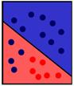
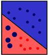
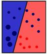
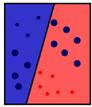
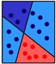
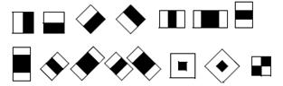
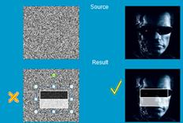
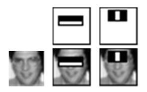
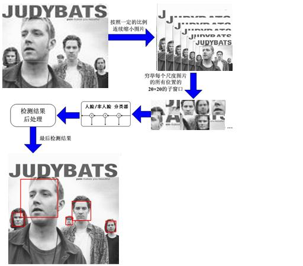

#一.人脸检测算法原理

##Viola-Jones人脸检测方法
> 参考文献：Paul Viola, Michael J. Jones. Robust Real-Time Face Detection[J].              
   International Journal of Computer Vision,2004,57(2):137-154.
   
   对人脸检测的研究最初可以追溯到 20 世纪 70 年代，早期的研究主要致力于模板匹配、子空间方法，变形模板匹配等。近期人脸检测的研究主要集中在基于**数据驱动**的**学习方法**，如统计模型方法，神经网络学习方法，统计知识理论和支持向量机方法，基于马尔可夫随机域的方法，以及基于肤色的人脸检测。目前在实际中应用的人脸检测方法多为基于 Adaboost 学习算法的方法。
     Viola人脸检测方法是一种基于积分图、 级联检测器和AdaBoost 算法的方法，方法框架可以分为以下三大部分:
     第一部分，使用Harr-like特征表示人脸，使用“ 积分图”实现特征数值的快速计算;
     第二部分， 使用Adaboost算法挑选出一些最能代表人脸的矩形特征( 弱分类器)，按照加权投票的方式将弱分类器构造为一个强分类器;
     第三部分， 将训练得到的若干强分类器串联组成一个级联结构的层叠分类器，级联结构能有效地提高分类器的检测速度。
    Adaboost 算法是一种用来分类的方法，它的基本原理就是“三个臭皮匠，顶个诸葛亮”。它把一些比较弱的分类方法合在一起，组合出新的很强的分类方法。
    例如下图中  


需要用一些线段把红色的球与深蓝色的球分开，然而如果仅仅画一条线的话，是分不开的。  

    

使用Adaboost算法来进行划分的话，先画出一条错误率最小的线段如图 1 ，但是左下脚的深蓝色球被错误划分到红色区域，因此加重被错误球的权重，再下一次划分时，将更加考虑那些权重大的球，如 c 所示，最终得到了一个准确的划分，如下图所示。  

    

人脸检测的目的就是从图片中找出所有包含人脸的子窗口，将人脸的子窗口与非人脸的子窗口分开。
***大致步骤***如下：
> * (1)在一个 20*20 的图片提取一些简单的特征（称为Harr特征），如下图所示。    
    

>> 它的计算方法就是将白色区域内的像素和减去黑色区域，因此在人脸与非人脸图片的相同位置上，值的大小是不一样的，这些特征可以用来区分人脸和分人脸。  

>       

> * (2)目前的方法是使用数千张切割好的人脸图片，和上万张背景图片作为训练样本。训练图片一般归一化到 20*20 的大小。在这样大小的图片中，可供使用的 haar 特征数在 1 万个左右，然后通过机器学习算法 —adaboost 算法挑选数千个有效的 haar 特征来组成人脸检测器。    
  

> * (3)学习算法训练出一个人脸检测器后，便可以在各个场合使用了。使用时，将图像按比例依次缩放，然后在缩放后的图片的 20*20 的子窗口依次判别是人脸还是非人脸。    


>     
人脸检测的流程
    
人脸检测在实际中主要用于人脸识别的预处理，即在图像中准确标定出人脸的位置和大小。

#二.OpenCV检测原理

> OpenCV中有检测人脸的函数（该函数还可以检测一些其他物体）， 甚至还包含一些预先训练好的物体识别文件。
所以利用这些现成的东西就可以很快做出一个人脸检测的程序。
>
***主要步骤为：***
* 1.加载分类器。
用cvLoad函数读入xml格式的文件。文件在OpenCV安装目录下的“data/haarcascades/”路径下。
http://blog.csdn.net/yang_xian521/article/details/6973667推荐使用haarcascade_frontalface_atl.xml和haarcascade_frontalface_atl2.xml
* 2.读入待检测图像。读入图片或者视频。
* 3.检测人脸。  

> 主要用的函数：
```
CvSeq* cvHaarDetectObjects( 
const CvArr* image, 
CvHaarClassifierCascade* cascade, 
CvMemStorage* storage, 
double scale_factor CV_DEFAULT(1.1), 
int min_neighbors CV_DEFAULT(3), 
int flags CV_DEFAULT(0), 
CvSize min_size CV_DEFAULT(cvSize(0,0)), 
CvSize max_size CV_DEFAULT(cvSize(0,0)) 
);
```
>  
* CvArr* image是一个灰度图像，如果设置了ROI，将只处理这个区域。
* CvHaarClassifierCascade* cascade是前面读入的分类器特征级联。
* CvMemStorage* storage 是这个算法的工作缓存。
* scale_factor ：算法用不同尺寸的窗口进行扫描，scale_factor是每两个不同大小的窗口之间的尺寸关系。
* min_neighbors 控制误检测，因为人脸会被不同位置大小的窗口重复检测到，至少有这么多次检测，我们才认为真的检测到了人脸。
flags有四个可用的数值，它们可以用位或操作结合使用。默认值是CV_HAAR_DO_CANNY_PRUNING，告诉分类器跳过平滑区域。
* min_size 指示寻找人脸的最小区域。max_size 显然应该是寻找人脸的最大区域了。


新建项目时,链接器—输入—附加依赖项—
```
opencv_core231d.lib
opencv_objdetect231d.lib
opencv_highgui231d.lib
opencv_imgproc231d.lib
```
静态图片的识别:

```cpp
#include <opencv2/opencv.hpp>  
#include <cstdio>  
#include <cstdlib>  
#include <Windows.h>  
using namespace std;  
int main()  
{  
    // 加载Haar特征检测分类器  
    // haarcascade_frontalface_alt.xml系OpenCV自带的分类器   
    const char *pstrCascadeFileName = "haarcascade_frontalface_alt.xml";  
    CvHaarClassifierCascade *pHaarCascade = NULL;  
    pHaarCascade = (CvHaarClassifierCascade*)cvLoad(pstrCascadeFileName);  
  
    // 载入图像  
    const char *pstrImageName = "lena.jpg";  
    IplImage *pSrcImage = cvLoadImage(pstrImageName, CV_LOAD_IMAGE_UNCHANGED);  
  
    IplImage *pGrayImage = cvCreateImage(cvGetSize(pSrcImage), IPL_DEPTH_8U, 1);  
    cvCvtColor(pSrcImage, pGrayImage, CV_BGR2GRAY);  
  
    // 人脸识别与标记  
    if (pHaarCascade != NULL)  
    {         
        CvScalar FaceCirclecolors[] =   
        {  
            {{0, 0, 255}},  
            {{0, 128, 255}},  
            {{0, 255, 255}},  
            {{0, 255, 0}},  
            {{255, 128, 0}},  
            {{255, 255, 0}},  
            {{255, 0, 0}},  
            {{255, 0, 255}}  
        };  
  
        CvMemStorage *pcvMStorage = cvCreateMemStorage(0);  
        cvClearMemStorage(pcvMStorage);  
        // 识别  
        DWORD dwTimeBegin, dwTimeEnd;  
        dwTimeBegin = GetTickCount();  
        CvSeq *pcvSeqFaces = cvHaarDetectObjects(pGrayImage, pHaarCascade, pcvMStorage);  
        dwTimeEnd = GetTickCount();  
  
        printf("人脸个数: %d   识别用时: %d ms\n", pcvSeqFaces->total, dwTimeEnd - dwTimeBegin);  
  
        // 标记  
        for(int i = 0; i <pcvSeqFaces->total; i++)  
        {  
            CvRect* r = (CvRect*)cvGetSeqElem(pcvSeqFaces, i);  
            CvPoint center;  
            int radius;  
            center.x = cvRound((r->x + r->width * 0.5));  
            center.y = cvRound((r->y + r->height * 0.5));  
            radius = cvRound((r->width + r->height) * 0.25);  
            cvCircle(pSrcImage, center, radius, FaceCirclecolors[i % 8], 2);  
        }  
        cvReleaseMemStorage(&pcvMStorage);  
    }  
  
    const char *pstrWindowsTitle = "人脸识别";  
    cvNamedWindow(pstrWindowsTitle, CV_WINDOW_AUTOSIZE);  
    cvShowImage(pstrWindowsTitle, pSrcImage);  
  
    cvWaitKey(0);  
  
    cvDestroyWindow(pstrWindowsTitle);  
    cvReleaseImage(&pSrcImage);   
    cvReleaseImage(&pGrayImage);  
    return 0;  
}  
```

视频中人脸检测:

```cpp
#include "cv.h"
#include "highgui.h"

#include <stdio.h>
#include <stdlib.h>
#include <string.h>
#include <assert.h>
#include <math.h>
#include <float.h>
#include <limits.h>
#include <time.h>
#include <ctype.h>


static CvMemStorage* storage = 0;
static CvHaarClassifierCascade* cascade = 0;
static CvHaarClassifierCascade* nested_cascade = 0;
int use_nested_cascade = 0;

void detect_and_draw( IplImage* image );

const char* cascade_name =
    "haarcascade_frontalface_alt.xml";
const char* nested_cascade_name =
    "haarcascade_eye_tree_eyeglasses.xml";

double scale = 1;

int main( int argc, char** argv )
{
    CvCapture* capture = 0;
    IplImage *frame, *frame_copy = 0;
    IplImage *image = 0;
    const char* scale_opt = "--scale=";
    int scale_opt_len = (int)strlen(scale_opt);
    const char* cascade_opt = "--cascade=";
    int cascade_opt_len = (int)strlen(cascade_opt);
    const char* nested_cascade_opt = "--nested-cascade";
    int nested_cascade_opt_len = (int)strlen(nested_cascade_opt);
    int i;
    const char* input_name = 0;

    for( i = 1; i < argc; i++ )
    {
        if( strncmp( argv[i], cascade_opt, cascade_opt_len) == 0 )
            cascade_name = argv[i] + cascade_opt_len;
        else if( strncmp( argv[i], nested_cascade_opt, nested_cascade_opt_len ) == 0 )
        {
            if( argv[i][nested_cascade_opt_len] == '=' )
                nested_cascade_name = argv[i] + nested_cascade_opt_len + 1;
            nested_cascade = (CvHaarClassifierCascade*)cvLoad( nested_cascade_name, 0, 0, 0 );
            if( !nested_cascade )
                fprintf( stderr, "WARNING: Could not load classifier cascade for nested objects\n" );
        }
        else if( strncmp( argv[i], scale_opt, scale_opt_len ) == 0 )
        {
            if( !sscanf( argv[i] + scale_opt_len, "%lf", &scale ) || scale < 1 )
                scale = 1;
        }
        else if( argv[i][0] == '-' )
        {
            fprintf( stderr, "WARNING: Unknown option %s\n", argv[i] );
        }
        else
            input_name = argv[i];
    }

    cascade = (CvHaarClassifierCascade*)cvLoad( cascade_name, 0, 0, 0 );

    if( !cascade )
    {
        fprintf( stderr, "ERROR: Could not load classifier cascade\n" );
        fprintf( stderr,
        "Usage: facedetect [--cascade=\"<cascade_path>\"]\n"
        "   [--nested-cascade[=\"nested_cascade_path\"]]\n"
        "   [--scale[=<image scale>\n"
        "   [filename|camera_index]\n" );
        return -1;
    }
    storage = cvCreateMemStorage(0);
    
    if( !input_name || (isdigit(input_name[0]) && input_name[1] == '\0') )
        capture = cvCaptureFromCAM( !input_name ? 0 : input_name[0] - '0' );
    else if( input_name )
    {
        image = cvLoadImage( input_name, 1 );
        if( !image )
            capture = cvCaptureFromAVI( input_name );
    }
    else
        image = cvLoadImage( "lena.jpg", 1 );

    cvNamedWindow( "result", 1 );

    if( capture )
    {
        for(;;)
        {
            if( !cvGrabFrame( capture ))
                break;
            frame = cvRetrieveFrame( capture );
            if( !frame )
                break;
            if( !frame_copy )
                frame_copy = cvCreateImage( cvSize(frame->width,frame->height),
                                            IPL_DEPTH_8U, frame->nChannels );
            if( frame->origin == IPL_ORIGIN_TL )
                cvCopy( frame, frame_copy, 0 );
            else
                cvFlip( frame, frame_copy, 0 );
            
            detect_and_draw( frame_copy );

            if( cvWaitKey( 10 ) >= 0 )
                goto _cleanup_;
        }

        cvWaitKey(0);
_cleanup_:
        cvReleaseImage( &frame_copy );
        cvReleaseCapture( &capture );
    }
    else
    {
        if( image )
        {
            detect_and_draw( image );
            cvWaitKey(0);
            cvReleaseImage( &image );
        }
        else if( input_name )
        {
            /* assume it is a text file containing the
               list of the image filenames to be processed - one per line */
            FILE* f = fopen( input_name, "rt" );
            if( f )
            {
                char buf[1000+1];
                while( fgets( buf, 1000, f ) )
                {
                    int len = (int)strlen(buf), c;
                    while( len > 0 && isspace(buf[len-1]) )
                        len--;
                    buf[len] = '\0';
                    printf( "file %s\n", buf ); 
                    image = cvLoadImage( buf, 1 );
                    if( image )
                    {
                        detect_and_draw( image );
                        c = cvWaitKey(0);
                        if( c == 27 || c == 'q' || c == 'Q' )
                            break;
                        cvReleaseImage( &image );
                    }
                }
                fclose(f);
            }
        }
    }
    
    cvDestroyWindow("result");

    return 0;
}

void detect_and_draw( IplImage* img )
{
    static CvScalar colors[] = 
    {
        {{0,0,255}},
        {{0,128,255}},
        {{0,255,255}},
        {{0,255,0}},
        {{255,128,0}},
        {{255,255,0}},
        {{255,0,0}},
        {{255,0,255}}
    };

    IplImage *gray, *small_img;
    int i, j;

    gray = cvCreateImage( cvSize(img->width,img->height), 8, 1 );
    small_img = cvCreateImage( cvSize( cvRound (img->width/scale),
                         cvRound (img->height/scale)), 8, 1 );

    cvCvtColor( img, gray, CV_BGR2GRAY );
    cvResize( gray, small_img, CV_INTER_LINEAR );
    cvEqualizeHist( small_img, small_img );
    cvClearMemStorage( storage );

    if( cascade )
    {
        double t = (double)cvGetTickCount();
        CvSeq* faces = cvHaarDetectObjects( small_img, cascade, storage,
                                            1.1, 2, 0
                                            //|CV_HAAR_FIND_BIGGEST_OBJECT
                                            //|CV_HAAR_DO_ROUGH_SEARCH
                                            |CV_HAAR_DO_CANNY_PRUNING
                                            //|CV_HAAR_SCALE_IMAGE
                                            ,
                                            cvSize(30, 30) );
        t = (double)cvGetTickCount() - t;
        printf( "detection time = %gms\n", t/((double)cvGetTickFrequency()*1000.) );
        for( i = 0; i < (faces ? faces->total : 0); i++ )
        {
            CvRect* r = (CvRect*)cvGetSeqElem( faces, i );
            CvMat small_img_roi;
            CvSeq* nested_objects;
            CvPoint center;
            CvScalar color = colors[i%8];
            int radius;
            center.x = cvRound((r->x + r->width*0.5)*scale);
            center.y = cvRound((r->y + r->height*0.5)*scale);
            radius = cvRound((r->width + r->height)*0.25*scale);
            cvCircle( img, center, radius, color, 3, 8, 0 );
            if( !nested_cascade )
                continue;
            cvGetSubRect( small_img, &small_img_roi, *r );
            nested_objects = cvHaarDetectObjects( &small_img_roi, nested_cascade, storage,
                                        1.1, 2, 0
                                        //|CV_HAAR_FIND_BIGGEST_OBJECT
                                        //|CV_HAAR_DO_ROUGH_SEARCH
                                        //|CV_HAAR_DO_CANNY_PRUNING
                                        //|CV_HAAR_SCALE_IMAGE
                                        ,
                                        cvSize(0, 0) );
            for( j = 0; j < (nested_objects ? nested_objects->total : 0); j++ )
            {
                CvRect* nr = (CvRect*)cvGetSeqElem( nested_objects, j );
                center.x = cvRound((r->x + nr->x + nr->width*0.5)*scale);
                center.y = cvRound((r->y + nr->y + nr->height*0.5)*scale);
                radius = cvRound((nr->width + nr->height)*0.25*scale);
                cvCircle( img, center, radius, color, 3, 8, 0 );
            }
        }
    }

    cvShowImage( "result1", img );
    cvReleaseImage( &gray );
    cvReleaseImage( &small_img );
}
```
